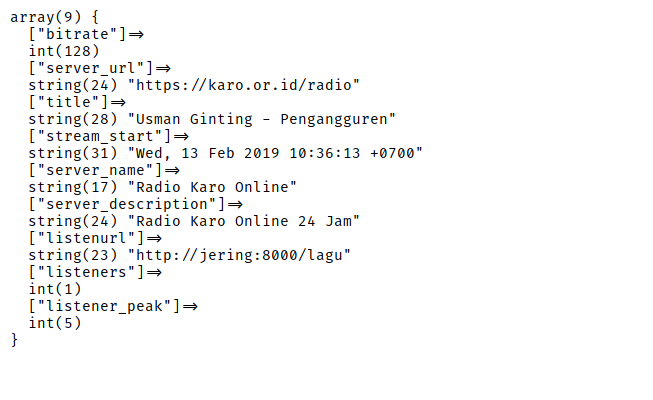

# icecast-php
Script ini hanya bisa digunakan untuk Icecast => 2.4.0.

## Contoh


```
<?php
// example.php
include 'icecast.php';

$ices = new Surbakti\IceCast();
$ices->setUrl('http://git.ndikkar.com:8000');
echo "<pre>";
var_dump($ices->getStatus());
```
output
```
array(9) {
  ["bitrate"]=>
  int(128)
  ["server_url"]=>
  string(24) "https://karo.or.id/radio"
  ["title"]=>
  string(28) "Usman Ginting - Pengangguren"
  ["stream_start"]=>
  string(31) "Wed, 13 Feb 2019 10:36:13 +0700"
  ["server_name"]=>
  string(17) "Radio Karo Online"
  ["server_description"]=>
  string(24) "Radio Karo Online 24 Jam"
  ["listenurl"]=>
  string(23) "http://jering:8000/lagu"
  ["listeners"]=>
  int(1)
  ["listener_peak"]=>
  int(5)
}
```
screenshot dari tampilan diatas
